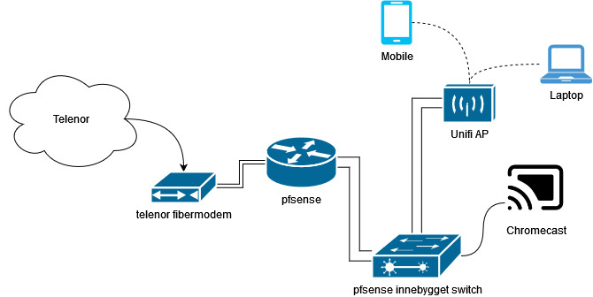

# Historie om hvordan jeg fikk IPv6 til å fungere på en pfsense maskin

## Bakground

Telenor har over en periode gjort det litt vanskeligere å få brukt ipv6 hvis man ønsker å bruke sitt eget utstyr, jeg har selv sent inn e-post om hjelp om hva som skal til for å få det til å fungere og har som regel fått svar som sier «du må nesten bruke Telenor ruteren som du har blitt tilsendt». Og til det så sier jeg nei! Jeg ønsker å bruke min egen ruter siden da føler jeg at jeg har mer kontroll over nettverket mitt hjemme.

Jeg ønsker også samtidig å sette opp nettverket til å bruke kun IPv6 der det lar seg gjøre og et solid utgangspunkt er at man kan bruke IPv6 i første omgang.

## Dagens oppsett

Per dags så har jeg "Bredbånd 500" etter at det tidligere som vil si at jeg har fiber rett inn i huster.

## Problemet

Som en person som er entusiast med nettverk, så tenke jeg at det bare var å «skru på» ipv6 på pfsense rutere, men det viste seg å ikke gi noe resultat. Jeg klødde meg i hodet å byttet ut pfsese boksen med ruteren som jeg fikk fra telenor, og BAM, der var ipv6 uten noen problemet. Så da begynner jeg å tenke, hvorfor funker det for dem og ikke meg?

## Feilsøking

Får å kunne se hva som faktisk skjedde, så måtte jeg komme meg i mellom telenor ruteren og pfsense maskinen min. Dette løste jeg med å sette opp port 3 og 4 til å være på sitt helt eget VLAN. Uplinken var koblet i port 3 og telenor ruteren var i port 4. Ved å skru på "Packet Capture" så var det mulig for meg å se trafikken i mellom. 

Etter å ha skrudd på packet capture, og skrur telenor ruteren av og på, så ser jeg det! ruteren er satt opp med "DUID-EN"

Pfsense har en default som ikke benytter seg av "DUID-EN", men heller "DUID-LLT". 

> By default, the firewall automatically creates a dynamic DUID-LLT which is not saved in the firewall configuration. To ensure that the same DUID is retained by the firewall at all times, enter a DUID in this section. The new DUID will take effect after a reboot or when the WAN interface(s) are reconfigured by the firewall.

## Oppsett med oppdatert informasjon

Nå som jeg har informasjon om hvordan telenor ruteren får IPv6, så kan jeg forsøke å replikere for å få se om jeg kan få en IPv6 adresse.

- steg 1: På WAN interfacet så endrer vi MAC adressen til å være det samme som vi så i packet capturen.

- Steg 2: under system -> advanced -> networking, endre på "DHCP6 DUID" til å være "DUID-EN: Assinged by vendor based on Enterprise Number". Under så må du skrive in informaskonen som du så i packet capturen:

NB: du må ha ":" mellom hex verdiene.

- steg 3: ved å vente et greit minut, så fikk fikk jeg en IPv6 addresse.

## Konklusjon

Jeg er usikker på hvorfor Telenor har valgt å gjøre IPv6 på denne måten, det gjør ting litt vanskeligere for den 0.1% av folket som ønsker å benytte seg av eget utsyr OG ønsker IPv6. Det er enkelt å spekulere at det er fordi de ønsker at slutt andre sluttbrukere skal benytte seg av wifi subscription på ruteren slik at de kan enklere rulle ut oppdateringer og tilsvarene. Hvis det blir for gammelt så er det også enkelt for dem å si «send den tilbake også får du ny», som kan være positivt for de som ikke liker å ha gamle rutere liggende i boden og samler støv.

Derimot, ved å bruke "DUID-EN" løsningen så sørger Telenor for at løsnigen de har forblir "proprietary". Fordelen er jo at de har et miljø og forholde seg til som gjør det enklere å tilby støtte til sluttbrukere, spesielt når de har en garanti som sier at du skal være fornøyd.

IPv6 har desverre et dårlig rykte på seg av mange grunner, og det å gjøre det vanskligere for personer som ønsker å bruke teknologien hjelper ikke på ryktet heller. På slutten av dagen så er IPv6 en måte å enkapsulere traffikken på, og vi lever fint på IPv4 fortsatt selv om at vi har gått tom for IPer.
